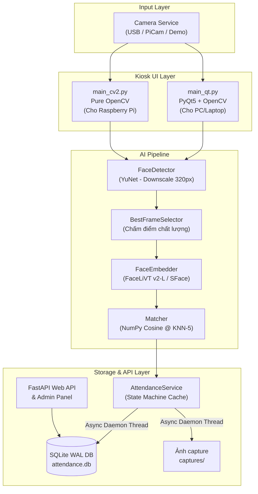

# 🧑‍💻 Hệ Thống Điểm Danh Bằng Nhận Diện Khuôn Mặt Trên Thiết Bị Nhúng

Dự án xây dựng hệ thống Kiosk điểm danh tự động bằng khuôn mặt, tối ưu hóa toàn diện để chạy mượt mà trên **Raspberry Pi 4/5** (ARM, CPU only, không cần GPU).


---

## 🌟 Các Điểm Cải Tiến & Tối Ưu Hóa Hiệu Năng (Mới Nhất)

Để đáp ứng cấu hình phần cứng hạn chế của Raspberry Pi 4, hệ thống đã được áp dụng hàng loạt giải pháp tối ưu hóa sâu:

### 1. Tối ưu hóa Inference Engine (XNNPACK)
- Cấu hình **ONNX Runtime** sử dụng `XNNPACKExecutionProvider` (tối ưu hóa tập lệnh ARM NEON cho Raspberry Pi).
- Giảm thời gian trích xuất vector embedding của mô hình **FaceLiVT v2-L** từ **~180ms xuống còn ~40ms** trên Pi 4.
- Cấu hình 4 intra-op threads và sequential execution để tận dụng tối đa 4 nhân CPU của Pi mà không gây quá nhiệt.

### 2. Kỹ thuật Frame Skipping thông minh
- Khi không phát hiện khuôn mặt trong khung hình (trạng thái Idle), hệ thống tự động **bỏ qua 2 trong 3 frame** (chỉ chạy YuNet detector mỗi 3 frame).
- Tiết kiệm **~60% tài nguyên CPU** khi không có người đứng trước Kiosk, tránh hiện tượng thermal throttling (giảm xung do quá nhiệt).
- Khi phát hiện mặt, hệ thống ngay lập tức chuyển sang quét liên tục từng frame để đảm bảo độ nhạy.

### 3. Tối ưu hóa YuNet Downscaling (320px Width)
- Resize ảnh đầu vào của camera từ `640x480` xuống chiều rộng cố định **`320px`** trước khi đưa vào YuNet.
- Giảm tải tính toán của bộ phát hiện khuôn mặt đi **gần 4 lần** mà vẫn giữ nguyên độ chính xác cao. Sau đó, các tọa độ bounding box và 5 facial landmarks được nhân tỷ lệ ngược về tọa độ gốc `640x480`.

### 4. SQLite WAL (Write-Ahead Logging) Mode & Concurrency
- Chuyển chế độ ghi của SQLite sang **WAL mode** (`PRAGMA journal_mode=WAL`).
- Cho phép camera thread/AI worker thread và FastAPI Web Dashboard đọc/ghi dữ liệu đồng thời mà không bị khóa database (`database is locked`), tối ưu hóa I/O trên thẻ nhớ SD của Raspberry Pi.

### 5. Xử lý ảnh Grayscale một lần duy nhất
- Trong module `BestFrameSelector`, quá trình chuyển đổi ảnh màu sang Grayscale để tính toán chỉ số độ sắc nét (Laplacian variance) và độ thẳng mặt chỉ thực hiện **duy nhất 1 lần**.
- Lưu trữ frame grayscale trong bộ nhớ đệm để tái sử dụng cho tất cả phép tính lọc chất lượng tiếp theo, tiết kiệm tài nguyên CPU đáng kể.

### 6. Ghi hình & Logging bất đồng bộ (Asynchronous DB Logging)
- Tách toàn bộ tác vụ ghi ảnh JPEG (`cv2.imencode`) và câu lệnh `INSERT` lịch sử điểm danh sang một **daemon thread** chạy ngầm.
- Trả kết quả nhận diện và mở khóa giao diện Kiosk ngay lập tức, không để luồng camera bị block bởi tốc độ ghi file chậm của thẻ nhớ SD.

### 7. Giảm thời gian chờ điểm danh xuống 0.8 giây
- Nhờ các tối ưu hóa ở trên, thời gian stabilization (giữ yên mặt trước camera) được rút ngắn từ **1.5 giây xuống còn 0.8 giây** mà vẫn đảm bảo độ chính xác vượt trội nhờ `BestFrameSelector` chọn ra frame nét nhất trong 0.8s đó.

---

## 🌟 Tính Năng Chính Của Hệ Thống

### 1. AI Pipeline Siêu Nhẹ & Dual-Backend

| Thành phần | Model | Kích thước | Kích thước Input | Output | Vai trò |
| :--- | :--- | :---: | :---: | :---: | :--- |
| **Face Detection** | YuNet (OpenCV DNN) | 240 KB | 320px width | BBox + 5 Landmarks | Phát hiện khuôn mặt real-time |
| **Face Recognition** | **FaceLiVT v2-L** (ONNX Runtime) | **35 MB** | 112x112 RGB | 512-dim embedding | Nhận diện chính (mặc định) |
| **Face Recognition** | **SFace** (OpenCV native) | **37 MB** | 112x112 RGB | 128-dim embedding | Fallback khi không có ONNX Runtime |

> [!NOTE]
> Hệ thống **tự động chọn backend** phù hợp với môi trường phần cứng:
> - Có thư viện `onnxruntime` → Sử dụng **FaceLiVT** (Chính xác cao, tối ưu cho khuôn mặt Châu Á).
> - Không cài được `onnxruntime` (môi trường Pi cũ) → Tự động fallback sang **SFace** qua thư viện OpenCV native.
> - Có thể chỉ định thủ công qua biến môi trường: `FACE_BACKEND=facelivt` hoặc `FACE_BACKEND=sface`.

### 2. Thuật toán so khớp KNN Top-5 Voting
- Thay vì so sánh 1-1 đơn thuần dễ bị sai số, hệ thống tìm kiếm **Top 5 embeddings gần nhất** trong cơ sở dữ liệu và áp dụng cơ chế **bầu chọn (voting)**.
- Người có số phiếu bầu cao nhất sẽ được chọn làm kết quả so khớp. Trường hợp bằng phiếu (tie-break), hệ thống ưu tiên người có khoảng cách Cosine nhỏ nhất (độ tương đồng cao nhất).
- **RAM Caching**: Toàn bộ embeddings được tải sẵn vào RAM dưới dạng ma trận NumPy `(N, D)`. Việc so khớp vector được thực hiện dưới dạng nhân ma trận vectorized `matrix @ query`, hoàn thành chỉ trong **< 0.5ms** đối với cơ sở dữ liệu 1,000 nhân viên.

### 3. Lọc khung hình chất lượng cao (Best Frame Selector)
Khi người dùng đứng trước camera, hệ thống chấm điểm chất lượng từng frame trong cửa sổ 0.8 giây để chọn ra frame tốt nhất gửi đến mô hình nhận diện:
- **Độ nét (Sharpness - 40%)**: Đo bằng phương sai của bộ lọc Laplacian (loại bỏ ảnh nhòe do di chuyển).
- **Độ thẳng mặt (Frontalness - 30%)**: Đo bằng độ lệch tọa độ Y giữa hai mắt (ưu tiên mặt nhìn thẳng).
- **Kích thước khuôn mặt (Size - 20%)**: Ưu tiên mặt có diện tích lớn, nằm ở khoảng cách vừa phải.
- **Độ sáng (Brightness - 10%)**: Tránh các ảnh bị cháy sáng hoặc quá tối.

### 4. Quản lý trạng thái điểm danh chống spam (State Machine)
- Quản lý vòng đời điểm danh nghiêm ngặt: `CHECK_IN ➔ CHECK_OUT ➔ CHECK_IN ➔ CHECK_OUT`.
- Áp dụng thời gian cooldown **1 phút** giữa các lần quẹt thẻ trùng lặp của cùng một nhân viên để chống spam dữ liệu.
- Lưu cache trạng thái điểm danh cuối cùng của mỗi nhân viên trong RAM để tránh việc truy vấn SQLite liên tục.

### 5. Web Dashboard quản trị (FastAPI + Jinja2)
- Quản lý thông tin nhân viên, phòng ban và tài khoản đăng nhập.
- Tra cứu lịch sử điểm danh với bộ lọc linh hoạt (ngày bắt đầu, ngày kết thúc, phòng ban).
- Xuất báo cáo điểm danh ra file CSV.
- Quản lý an toàn dữ liệu: Xóa nhân viên sẽ cascade xóa toàn bộ embeddings, lịch sử điểm danh và file ảnh vật lý trên đĩa.

---

## 🏗️ Kiến Trúc Hệ Thống

### Sơ đồ luồng xử lý và dữ liệu



---

## ⚙️ Cấu Trúc Thư Mục Dự Án

```
FaceRecognitionAttendance/
├── app/                          # Mã nguồn chính của ứng dụng
│   ├── config.py                 # Cấu hình tập trung (thresholds, paths, timings)
│   ├── camera_service.py         # Trừu tượng hóa Camera (Pi Camera v2 / USB / Demo)
│   ├── face_detector.py          # Phát hiện khuôn mặt bằng YuNet + Landmarks
│   ├── face_embedder.py          # Trích xuất vector 512d (FaceLiVT) hoặc 128d (SFace)
│   ├── best_frame_selector.py    # Lọc và giữ frame chất lượng nhất trong RAM
│   ├── matcher.py                # So khớp KNN Top-5 ma trận vectorized trong RAM
│   ├── attendance_service.py     # State machine IN/OUT, cooldown và luồng ghi log ngầm
│   ├── database.py               # Quản lý SQLite DB, schemas, và bcrypt authentication
│   ├── main_cv2.py               # Giao diện Kiosk bằng OpenCV (Tối ưu cho Pi không có PyQt5)
│   ├── main_qt.py                # Giao diện Kiosk bằng PyQt5 + OpenCV (Giao diện PC đẹp, hỗ trợ tiếng Việt)
│   ├── main.py                   # Giao diện Kiosk OpenCV cũ (legacy)
│   ├── web_api.py                # Web server quản lý và API FastAPI
│   └── web_ui/                   # File HTML Jinja2 (dashboard quản trị)
├── benchmarks/                   # Công cụ đo đạc hiệu năng & tuning thresholds
│   ├── benchmark_pipeline.py     # Đánh giá độ chính xác toàn bộ pipeline nhận diện
│   ├── benchmark_latency.py      # Đo thời gian xử lý từng module
│   ├── benchmark_latency_3models.py # So sánh latency của các dòng model FaceLiVT và SFace
│   ├── sweep_threshold.py        # Tìm ngưỡng cosine similarity tối ưu nhất
│   └── plot_bell_curves.py       # Vẽ biểu đồ bell curve phân bố khoảng cách similarity
├── models/                       # Chứa các file ONNX chạy mô hình
│   ├── face_detection_yunet_2023mar.onnx
│   └── facelivtv2_l.onnx         # Mô hình FaceLiVT v2-Large mặc định (35.2 MB)
├── scripts/                      # Các script bổ trợ
│   ├── setup_pi.sh               # Tự động hóa cài đặt môi trường trên Raspberry Pi
│   ├── build_onnxruntime_pi.sh   # Hướng dẫn build ONNX Runtime cho ARMv8
│   ├── diagnose_pi.py            # Script kiểm tra môi trường cài đặt trên Pi
│   ├── enroll_from_folder.py     # Đăng ký hàng loạt nhân viên từ folder ảnh sẵn có
│   └── seed_data.py              # Khởi tạo dữ liệu giả lập cho hệ thống
├── tests/                        # Bộ kiểm thử tự động (Custom Test Suite)
│   └── run_tests.py              # Chạy 44 kịch bản kiểm thử toàn diện
├── requirements.txt              # Thư viện cho PC (bao gồm PyQt5, onnxruntime)
├── requirements_pi.txt           # Thư viện cho Pi (không có PyQt5, không tự cài numpy/opencv)
├── run.py                        # Entry point khởi chạy Kiosk PyQt5 (cho PC)
├── run_cv2.py                    # Entry point khởi chạy Kiosk OpenCV (cho Pi)
└── setup.py                      # Thiết lập lần đầu (tải model, tạo DB, cài deps)
```

---

## 🚀 Hướng Dẫn Cài Đặt và Chạy

### A. Cài đặt trên Máy tính cá nhân (Windows/macOS/Linux)

```bash
# 1. Clone mã nguồn về máy
git clone <URL_REPO>
cd FaceRecognitionAttendance

# 2. Khởi tạo môi trường ảo Python
python -m venv .venv
# Kích hoạt trên Windows:
.venv\Scripts\activate
# Kích hoạt trên Linux/macOS:
source .venv/bin/activate

# 3. Cài đặt các thư viện cần thiết
pip install -r requirements.txt

# 4. Tải các mô hình AI và thiết lập database ban đầu
python setup.py

# 5. Khởi chạy giao diện Kiosk điểm danh
python run.py       # Giao diện PyQt5 (Unicode tiếng Việt, khuyên dùng)
# Hoặc:
python run_cv2.py   # Giao diện Pure OpenCV

# 6. Khởi chạy Web Dashboard quản lý (Chạy ở terminal khác)
uvicorn app.web_api:api --host 0.0.0.0 --port 8000
```
Mở trình duyệt truy cập `http://localhost:8000`. Tài khoản quản trị mặc định: `admin` / `admin123`.

---

### B. Cài đặt trên Raspberry Pi 4/5 (64-bit OS)

> [!IMPORTANT]
> - Yêu cầu sử dụng hệ điều hành **Raspberry Pi OS 64-bit (aarch64)**. ONNX Runtime không hỗ trợ bản 32-bit.
> - **KHÔNG** chạy lệnh `pip install opencv-python` hay `pip install numpy` trực tiếp trên Pi vì có thể bị lỗi biên dịch hoặc crash phần cứng. Hãy sử dụng bản phân phối APT của hệ điều hành.

```bash
# 1. Di chuyển vào thư mục dự án trên Pi
cd ~/FaceRecognitionAttendance

# 2. Cấp quyền và chạy script cài đặt tự động cho Pi
chmod +x scripts/setup_pi.sh
bash scripts/setup_pi.sh

# 3. Kích hoạt môi trường ảo đã cấu hình cho Pi
source venv_pi/bin/activate

# 4. Chạy chẩn đoán để xác nhận hệ thống sẵn sàng
python scripts/diagnose_pi.py

# 5. Khởi chạy Kiosk điểm danh (Pure OpenCV UI)
# Sử dụng USB Camera:
python run_cv2.py --source usb --camera 0
# Sử dụng Pi Camera Module:
python run_cv2.py --source picam

# 6. Khởi chạy Web Dashboard
uvicorn app.web_api:api --host 0.0.0.0 --port 8000
```

---

## 🔧 Các Tham Số Cấu Hình Quan Trọng

Toàn bộ cấu hình của hệ thống được tập trung tại file [app/config.py](file:///d:/DAN/2.%20DAN/Bài%20tập/TTNT%20cho%20hệ%20thống%20nhúng/Đồ%20án%20hệ%20thống%20nhúng/FaceRecognitionAttendance/app/config.py):

| Tên tham số | Giá trị mặc định | Mô tả |
| :--- | :---: | :--- |
| `PREFERRED_BACKEND` | `"auto"` | Phương án trích xuất: `"auto"`, `"facelivt"`, hoặc `"sface"` |
| `STABLE_FACE_SECONDS` | `0.8` | Thời gian đứng trước camera tối thiểu để nhận diện (giây) |
| `DUPLICATE_COOLDOWN_MINUTES` | `1` | Thời gian cooldown tối thiểu giữa 2 lần điểm danh của 1 nhân viên |
| `FACELIVT_COSINE_THRESHOLD` | `0.400` | Ngưỡng Cosine Similarity tối thiểu để nhận dạng bằng FaceLiVT v2-L |
| `SFACE_COSINE_THRESHOLD` | `0.363` | Ngưỡng Cosine Similarity tối thiểu để nhận dạng bằng SFace |
| `CAMERA_WIDTH` & `CAMERA_HEIGHT` | `640` & `480` | Độ phân giải của Camera |
| `SECRET_KEY` | (Hardcoded) | Khóa bảo mật session. **Phải thay đổi khi deploy thực tế** |

Bạn có thể thay thế nhanh backend nhận diện lúc runtime mà không cần sửa code bằng cách đặt biến môi trường:
```bash
FACE_BACKEND=sface python run_cv2.py --source usb
```

---

## 📊 Kết Quả Benchmark Mới Nhất

### ⚡ So sánh các mô hình nhận diện tại Ngưỡng Tối Ưu (Optimal Thresholds)
*Benchmark được thực hiện trên bộ dữ liệu **dataset_clean** (bao gồm 224 người đăng ký, 957 ảnh test probe). Các ngưỡng được quét tối ưu tự động bằng công cụ `sweep_both_models.py` để tìm điểm cân bằng F1-score.*

| Chỉ số đánh giá | SFace (128d) | FaceLiVT v2-S (512d) | FaceLiVT v2-L (512d) |
| :--- | :---: | :---: | :---: |
| **Ngưỡng tối ưu (Threshold)** | 0.400 | 0.200 | **0.400** |
| **Độ chính xác (Accuracy)** | 90.28% | 89.86% | **92.71%** |
| **Tỷ lệ nhận nhầm người (FAR)** | 9.09% | 9.93% | **4.10%** |
| **Tỷ lệ từ chối sai (FRR)** | 0.63% | 0.21% | **3.19%** |
| **Thời gian trích xuất trên Pi 4** | ~40 ms | ~60 ms (INT8) | ~40 ms (XNNPACK) |
| **Kích thước file mô hình** | 36.9 MB | 16.5 MB | 35.2 MB |

> [!TIP]
> - **Mô hình mặc định FaceLiVT v2-L** đạt độ chính xác cao nhất (**92.71%**) và giảm thiểu tối đa tỷ lệ nhận nhầm người xuống chỉ còn **4.10%**. Nhờ tối ưu hóa bằng XNNPACK, thời gian xử lý của mô hình này trên Pi 4 hoàn toàn tương đương SFace (~40ms).
> - **SFace** là sự lựa chọn thay thế tốt nếu bạn không muốn phụ thuộc vào ONNX Runtime, với độ chính xác đạt khá ổn định (90.28%).

---

## 🔒 Khuyến Cáo Bảo Mật Khi Triển Khai
Trước khi triển khai ứng dụng vào môi trường hoạt động thực tế, bạn cần chú ý các điều sau để đảm bảo an toàn hệ thống:
1. **Thay đổi mật khẩu tài khoản Admin mặc định** (`admin123`) trên bảng điều khiển.
2. **Cập nhật `SECRET_KEY` trong `app/config.py`**: Chuyển sang một chuỗi ký tự ngẫu nhiên, dài và bảo mật bằng biến môi trường hoặc thay đổi trực tiếp file cấu hình.
3. **Độ an toàn mật khẩu**: Hệ thống sử dụng thuật toán băm `bcrypt` với cost factor 12, đảm bảo khả năng chống tấn công brute-force cơ sở dữ liệu.
4. **Không tương thích ngược**: Nếu thay đổi backend AI (ví dụ từ FaceLiVT sang SFace hoặc ngược lại), bạn **phải xóa và ghi danh lại (enroll) khuôn mặt của nhân viên** do định dạng vector và độ dài vector (128-dim vs 512-dim) hoàn toàn khác nhau.

---
*Đồ án nghiên cứu và xây dựng hệ thống chấm công bằng Camera nhận diện khuôn mặt trên Hệ thống nhúng.*  
*Phát triển bởi **Bùi Văn Đan (@danbui)**.*